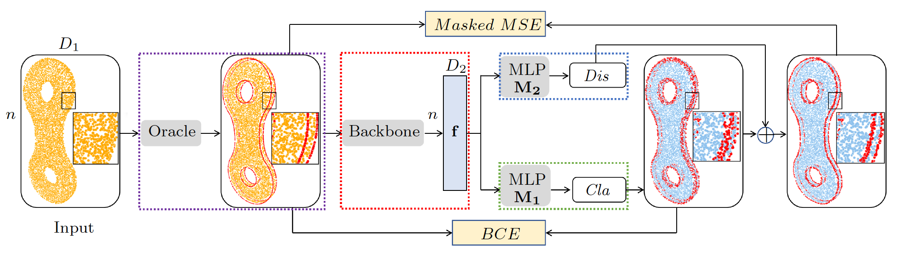

# SFCNet

This repository contains the official implementation of paper ["Sharp feature consolidation from raw 3D point clouds via displacement learning"](https://www.sciencedirect.com/science/article/abs/pii/S0167839623000365), published in [Computer Aided Geometric Design](https://www.sciencedirect.com/journal/computer-aided-geometric-design), and presented at [International Conference on Geometric Modeling and Processing (GMP) 2023](https://gmpconf.github.io/GMP2023/index.html).

Authors: [Tong Zhao](https://tong-zhao.github.io), [Mulin Yu](http://www-sop.inria.fr/members/Mulin.Yu/), [Florent Lafarge](http://www-sop.inria.fr/members/Mulin.Yu/) and [Pierre Alliez](https://team.inria.fr/titane/pierre-alliez/).




---
## Abstract
> Detecting sharp features in raw 3D point clouds is an essential step for designing efficient priors in several 3D Vision applications. This paper presents a deep learning-based approach that learns to detect and consolidate sharp feature points on raw 3D point clouds. We devise a multi-task neural network architecture that identifies points near sharp features and predicts displacement vectors toward the local sharp features. The so-detected points are thus consolidated via relocation. Our approach is robust against noise by utilizing a dynamic labeling oracle during the training phase. The approach is also flexible and can be combined with several popular point-based network architectures. Our experiments demonstrate that our approach outperforms the previous work in terms of detection accuracy measured on the popular ABC dataset. We show the efficacy of the proposed approach by applying it to several 3D vision tasks.

---
## Citation

```
@article{ZHAO_2023_GMP,
    title = {Sharp feature consolidation from raw 3D point clouds via displacement learning},
    journal = {Computer Aided Geometric Design},
    volume = {103},
    pages = {102204},
    year = {2023},
    issn = {0167-8396},
    doi = {https://doi.org/10.1016/j.cagd.2023.102204},
    url = {https://www.sciencedirect.com/science/article/pii/S0167839623000365},
    author = {Tong Zhao and Mulin Yu and Pierre Alliez and Florent Lafarge}
}
```
